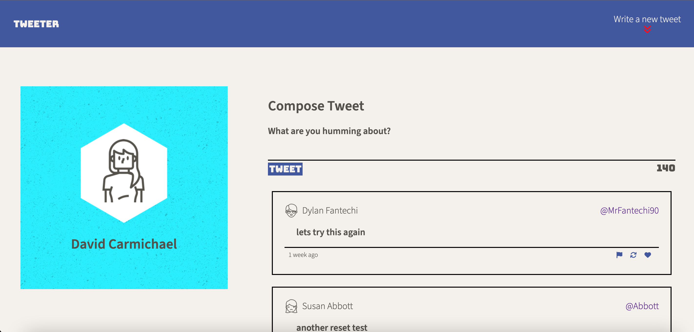
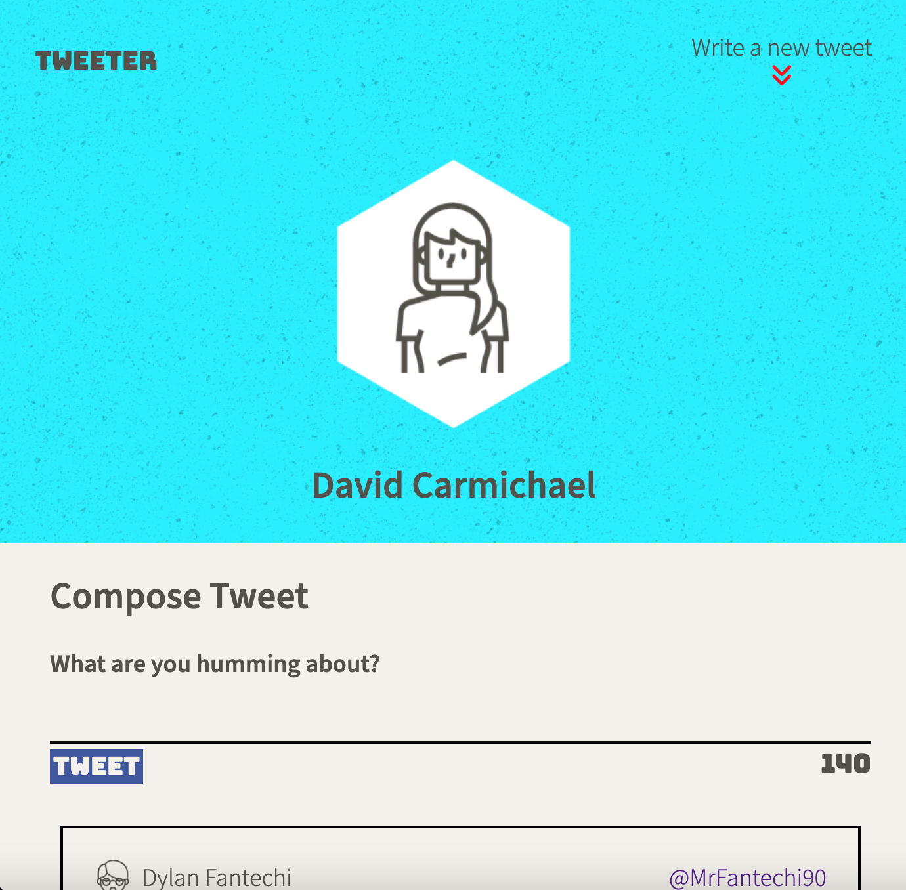

# Tweeter Project

Tweeter is a simple, single-page Twitter clone. This project with Lighthouse Labs to practice and develop front end skills such as HTML, CSS, SASS, and front end JS. Feel freel to review the code, clone it and test out this simple app to create and post tweets. Backend Server code was provided by Lighthouse Labs.

## Desktop and Mobile Views

## Getting Started

1. Clone repository onto your local device.
2. Install dependencies using the `npm install` command.
3. Start the web server using the `npm run local` command. The app will be served at <http://localhost:8080/>.
4. Go to <http://localhost:8080/> in your browser.
5. Write a tweet!

## Changing Styles

This project uses SASS to compile stylesheets. Ensure SASS is installed 'npm install -g sass' if not already installed
Use command `npm run sass-watch` to compile stylesheets

## Dependencies

- Express
- Node 5.10.x or above

